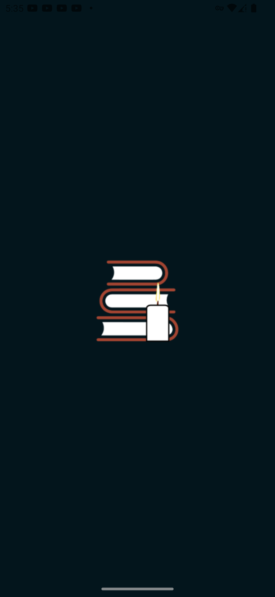
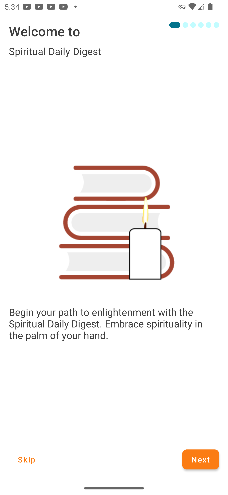
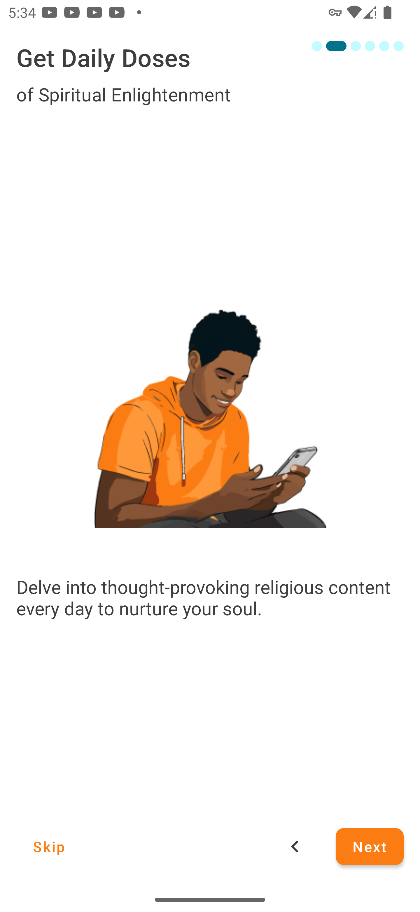
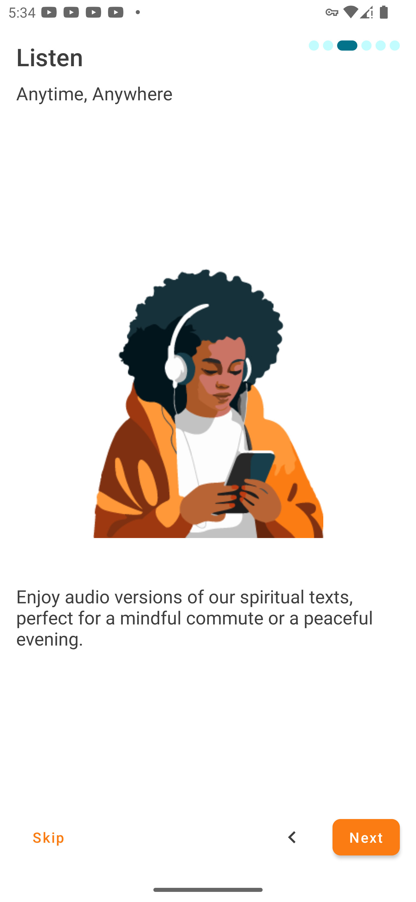
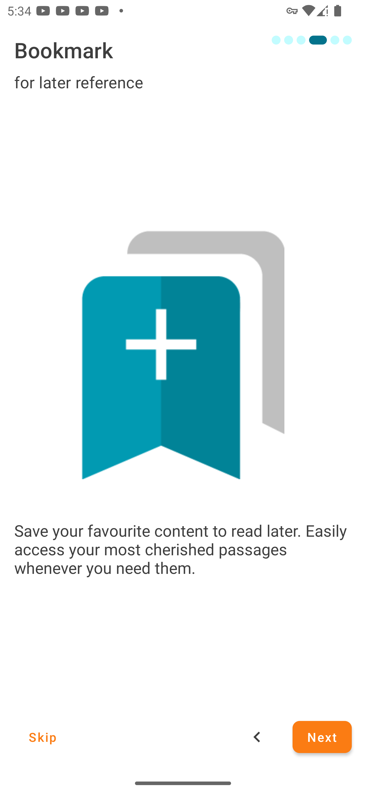
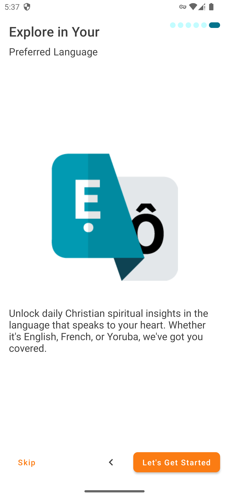

# Spiritual Daily Digest

## Author

[Bello Abraham](https://www.linkedin.com/in/belloabraham) (Single handedly built by me)

<!-- ## Live Demo

[Spiritual Daily Digest on Google Play Store](https://play.google.com/store/apps/details?id=com.bookshelfhub.bookshelfhub) -->

## Technologies Used

- Kotlin
- Android SDK
- Retrofit
- UI with Jetpack Compose
- Android Jetpack Libraries
- Dagger Hilt
- Others

## Description

Spiritual Daily Digest is a daily devotional Android application designed to inspire and uplift users with spiritual content. Written in Kotlin, this app provides a user-friendly interface to access daily devotional readings, prayers, and inspirational quotes.

## Features

- Daily devotional readings
- User-friendly interface for a seamless reading experience
- Bookmarking feature to save favorite devotions
- Daily Notifications to remind users of daily readings
- Multi Lingual

## Onboarding Screenshot

- 
   
- 
   
- 
   
- 
   
- 
   
- 
   
- 
